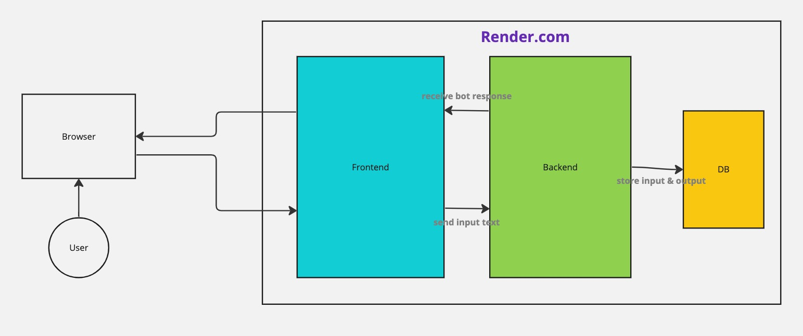

## Chatter app

This is a simple chat application that allows users to chat with bots, built Next.js and Golang (Gin).

just hobby project to learn Next.js (App Router) and Golang (Structures)

## Features
- Chat with bots
  - 今日の東京の天気は？
  - 今何時？
  - こんにちは

